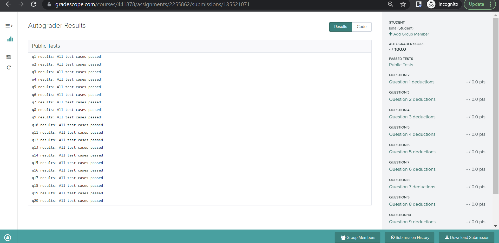

# Project 11 (P11): Analyzing Stars and Planets


## Corrections and clarifications:

* None yet.

**Find any issues?** Report to us:

- Kincannon Wilson <kgwilson2@wisc.edu>
- Chaitanya Kabra <ckabra@wisc.edu>


## Instructions:

This project will focus on **data analysis**, **creating scatter plots**, and **recursion**. In this project, you will continue from where you left off in P10. You will analyze the data structures you created in P10 to answer some interesting questions about our dataset.

To start, download [`p11.ipynb`](https://git.doit.wisc.edu/cdis/cs/courses/cs220/cs220-s23-projects/-/tree/main/p11/p11.ipynb), [`p11_test.py`](https://git.doit.wisc.edu/cdis/cs/courses/cs220/cs220-s23-projects/-/tree/main/p11/p11_test.py), [`p11_plots.json`](https://git.doit.wisc.edu/cdis/cs/courses/cs220/cs220-s23-projects/-/tree/main/p11/p11_plots.json), and [`broken_data.zip`](https://git.doit.wisc.edu/cdis/cs/courses/cs220/cs220-s23-projects/-/tree/main/p11/broken_data.zip).

After downloading `broken_data.zip`, make sure to extract it (using [Mac directions](http://osxdaily.com/2017/11/05/how-open-zip-file-mac/) or [Windows directions](https://support.microsoft.com/en-us/help/4028088/windows-zip-and-unzip-files)). After extracting, you should see a folder called `broken_data`. You may delete `broken_data.zip` after extracting the files inside it.

You may also download [`data.zip`](https://git.doit.wisc.edu/cdis/cs/courses/cs220/cs220-s23-projects/-/tree/main/p11/data.zip) and extract it. Alternatively, you could also copy/paste the `data` directory that you worked with in P10 into your P11 directory.

**Important**: You **must** make sure that your file structure looks like this:

```
+-- p11.ipynb
+-- p11_test.py
+-- p11_plots.json
+-- data
|   +-- .DS_Store
|   +-- .ipynb_checkpoints
|   +-- mapping_1.json
|   +-- mapping_2.json
|   +-- mapping_3.json
|   +-- mapping_4.json
|   +-- mapping_5.json
|   +-- planets_1.csv
|   +-- planets_2.csv
|   +-- planets_3.csv
|   +-- planets_4.csv
|   +-- planets_5.csv
|   +-- stars_1.csv
|   +-- stars_2.csv
|   +-- stars_3.csv
|   +-- stars_4.csv
|   +-- stars_5.csv
+-- broken_data
|   +-- .DS_Store
|   +-- .ipynb_checkpoints
|   +-- hds
|   |   +-- .ipynb_checkpoints
|   |   +-- hd_1000s
|   |   |   +-- hd_10000s.json
|   |   +-- others.json
|   +-- k2s.json
|   +-- keplers
|   |   +-- kepler_100s
|   |   |   +-- kepler_100s
|   |   |   |   +-- kepler_100s
|   |   |   |   |   +-- kepler_100s.json
|   |   |   |   +-- others.json
|   |   |   +-- kepler_200s
|   |   |   |   +-- .ipynb_checkpoints
|   |   |   |   +-- kepler_220s.json
|   |   |   |   +-- kepler_290s.json
|   |   |   |   +-- others
|   |   |   |   |   +-- others.json
|   |   |   +-- others.json
|   |   +-- kepler_10s
|   |   |   +-- kepler_80s
|   |   |   |   +-- kepler_80s.json
|   |   |   +-- others
|   |   |   |   +-- kepler_20s.json
|   |   |   |   +-- kepler_30s.json
|   |   |   |   +-- others.json
|   |   +-- others
|   |   |   +-- .DS_Store
|   |   |   +-- others.json
|   +-- others
|   |   +-- .DS_Store
|   |   +-- gjs.json
|   |   +-- others.json
|   |   +-- tois
|   |   |   +-- tois.json
```

Otherwise, your code may pass on **your computer**, but **fail** on the testing computer.

You will work on `p11.ipynb` and hand it in. You should follow the provided directions for each question. Questions have **specific** directions on what **to do** and what **not to do**.

------------------------------

## IMPORTANT Submission instructions:
- Review the [Grading Rubric](https://git.doit.wisc.edu/cdis/cs/courses/cs220/cs220-s23-projects/-/tree/main/p11/rubric.md), to ensure that you don't lose points during code review.
- You must **save your notebook file** before you run the cell containing **export**.
- Login to [Gradescope](https://www.gradescope.com/) and upload the zip file into the P11 assignment.
- If you completed the project with a **partner**, make sure to **add their name** by clicking "Add Group Member"
in Gradescope when uploading the p11 zip file.

   

   **Warning:** You will have to add your partner on Gradescope even if you have filled out this information in your `p11.ipynb` notebook.

- It is **your responsibility** to make sure that your project clears auto-grader tests on the Gradescope test system. Otter test results should be available in a few minutes after your submission. You should be able to see both PASS / FAIL results for the 20 test cases and your total score, which is accessible via Gradescope Dashboard (as in the image below):

    
- **Important:** After you submit, you **need to verify** that your code is visible on Gradescope. If you displayed the output of a large variable (such as `planets_list`) anywhere in your notebook, **we will not be able to view or grade your submission**. Make sure you don't have any large outputs in any of your cells, and verify after submission that your code can be viewed.
- If you feel you have been incorrectly graded on a particular question by the Gradescope autograder, please file a regrade request.
